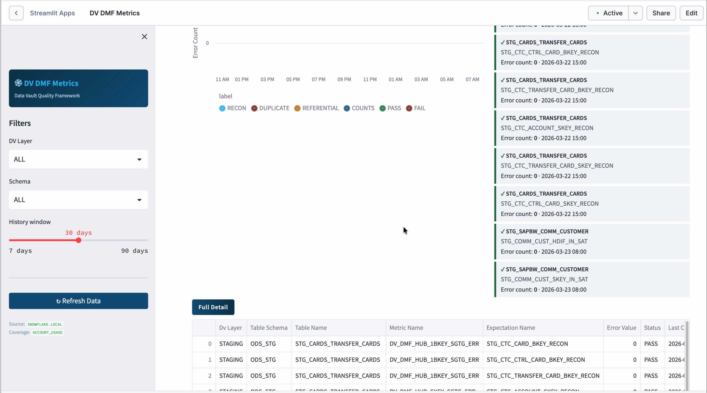

# Snowflake DMF — Data Vault 2.0 Quality Framework

> **This is a template, you are responsible for making it work in your own Snowflake account.**
>
> This project is open source. Developers are responsible for maintaining and adapting their own code.

A complete Data Quality monitoring framework for **Data Vault 2.0** built on
**Snowflake Data Metric Functions (DMFs)**, featuring a real-time Streamlit
dashboard, Slack alerting, and a reusable library of 17 custom DMFs.



https://github.com/PatrickCuba/the_data_must_flow/blob/master/data-auto-testing/snowflake_dmf/assets/demo.mp4

---

## Quick Start (Snow CLI)

```bash
git clone https://github.com/PatrickCuba/the_data_must_flow.git
cd the_data_must_flow/data-auto-testing/snowflake_dmf

./scripts/deploy.sh \
  --connection  my_connection \
  --database    DV_DQ \
  --schema      DQ \
  --warehouse   DV_DQ_WH \
  --edw-database MY_EDW_DB
```

This single command will:
1. Create the warehouse, database, schema, and grants
2. Create all 17 Data Metric Functions
3. Attach DMFs to the example DV tables (requires `--edw-database`)
4. Deploy the Streamlit monitoring dashboard

> **Dashboard only?** Omit `--edw-database` to skip DMF attachment — you can
> attach DMFs to your own tables later.

### Deploy script options

| Flag | Default | Description |
|---|---|---|
| `--connection` | *(required)* | Snowflake CLI connection name |
| `--database` | `DV_DQ` | Target database for DMFs + app |
| `--schema` | `DQ` | Target schema |
| `--edw-database` | *(none)* | EDW database with your DV tables |
| `--warehouse` | `DV_DQ_WH` | Warehouse to create / use |
| `--role` | `ACCOUNTADMIN` | Deploying role |
| `--skip-setup` | | Skip infrastructure (re-deploy code only) |
| `--skip-dmfs` | | Skip DMF creation |
| `--skip-attach` | | Skip DMF attachment |
| `--prune` | | Remove stale files from stage |

### Re-deploy Streamlit app only

```bash
./scripts/deploy.sh \
  --connection my_connection \
  --database DV_DQ \
  --schema DQ \
  --warehouse DV_DQ_WH \
  --skip-setup --skip-dmfs
```

---

## Manual Installation (no CLI)

If you don't have the Snowflake CLI, use the Snowsight worksheet method:

1. Open `scripts/install_manual.sql` in a Snowsight worksheet
2. Edit the variables at the top (database, schema, warehouse, role)
3. Run the full script (Ctrl+Shift+Enter)
4. Upload `streamlit_app.py` and `pyproject.toml` to the stage via Snowsight UI
5. Run `sql/01_create_dq_schema_and_dmfs.sql` (replace `<% database %>` with your database name)
6. Run `sql/02_attach_dmfs_to_dv_tables.sql` (adapt table/column names to your model)

---

## Prerequisites

- Snowflake account with Data Metric Functions enabled
- `ACCOUNTADMIN` role (or equivalent privileges)
- [Snowflake CLI](https://docs.snowflake.com/en/developer-guide/snowflake-cli/index) v3.4+ (for automated deploy)
- For Slack alerts: an incoming webhook URL

---

## Repo Structure

```
snowflake_dmf/
├── streamlit_app.py              Main Streamlit dashboard (9 tabs)
├── pyproject.toml                Python dependencies
├── snowflake.yml.template        Streamlit deploy config (auto-generated by deploy.sh)
├── .gitignore
├── scripts/
│   ├── deploy.sh                 One-command deploy script
│   ├── setup.sql                 Infrastructure setup (idempotent)
│   └── install_manual.sql        Manual install for Snowsight (no CLI needed)
├── sql/
│   ├── 01_create_dq_schema_and_dmfs.sql     17 reusable DMFs
│   ├── 02_attach_dmfs_to_dv_tables.sql      Example attachments (adapt to your model)
│   ├── 03_dq_dashboard_views.sql            Monitoring views (optional)
│   └── 03_alerts.sql                        Slack alerts (optional, needs webhook)
├── assets/
│   ├── screenshot.png            Dashboard screenshot
│   └── demo.mp4                  Demo video
└── README.md
```

---

## Architecture

```
<DATABASE>.<SCHEMA>       — Custom DMF library + monitoring views + Streamlit app
<DATABASE>.ALERTS         — Slack alert stored procedures + Snowflake Alerts (optional)
<EDW_DB>.<schema>         — Your Data Vault tables (HUB, LNK, SAT)
SNOWFLAKE.LOCAL           — Snowflake-native DMF result views (built-in)
SNOWFLAKE.ACCOUNT_USAGE   — DMF coverage metadata (up to 3h latency)
```

---

## DMF Library (17 functions)

### Duplicate Checks — HUB

| DMF | Checks |
|---|---|
| `DV_DMF_HUB_SKEY_DUPE_err` | Hub surrogate hash key uniqueness |
| `DV_DMF_HUB_1BKEY_DUPE_err` | Business key (tenant + colcode + bkey1) uniqueness |
| `DV_DMF_HUB_2BKEY_DUPE_err` | 2-part business key uniqueness |
| `DV_DMF_HUB_3BKEY_DUPE_err` | 3-part business key uniqueness |

### Duplicate Checks — LNK

| DMF | Checks |
|---|---|
| `DV_DMF_LNK_SKEY_DUPE_err` | Link surrogate hash key uniqueness |
| `DV_DMF_LNK_2HKEY_DUPE_err` | 2-hub FK key combination uniqueness |
| `DV_DMF_LNK_3HKEY_DUPE_err` | 3-hub FK key combination uniqueness |
| `DV_DMF_LNK_4HKEY_DUPE_err` | 4-hub FK key combination uniqueness |
| `DV_DMF_LNK_5HKEY_DUPE_err` | 5-hub FK key combination uniqueness |

### Duplicate Checks — SAT

| DMF | Checks |
|---|---|
| `DMF_DV_SAT_DUPE` | Regular SAT composite key (skey + load_ts + tenant + hashdiff) |
| `DMF_DV_SAT_MA_DUPE` | Multi-active SAT (+ sequence key) |
| `DMF_DV_SAT_DP_DUPE` | Dependent child SAT (+ dependent child key) |

### Orphan Checks

| DMF | Checks |
|---|---|
| `DV_DMF_SAT_SKEY_ORPH_ERR` | SAT FK keys not in parent HUB/LNK (excludes GHOST records) |
| `DV_DMF_LNK_SKEY_ORPH_ERR` | LNK FK keys not in parent HUB |

### Reconciliation Checks

| DMF | Checks |
|---|---|
| `DMF_DV_HUB_RECON` | Latest-batch staged hub keys missing from target HUB |
| `DMF_DV_LNK_RECON` | Latest-batch staged link keys missing from target LNK |
| `DMF_DV_SAT_RECON` | Latest-batch staged (skey + tenant + hashdiff) missing from current SAT |

---

## Dashboard (9 Tabs)

| Tab | Description |
|---|---|
| **Overview** | KPI row, health by DV layer & check type, active violations |
| **Basic Counts** | All tables — latest status, pass %, layer breakdown |
| **Reconciliation** | Staged → target recon checks with error trend charts |
| **Referential Integrity** | Orphan checks with trend charts & summary cards |
| **Duplicate Checks** | Duplicate error trends by table |
| **Per Artefact** | Select any table to see its full DMF history |
| **Growth Trends** | Error heatgrid (table × day) + daily run vs violation chart |
| **DMF Coverage** | Coverage map from ACCOUNT_USAGE (up to 3h latency) |
| **Schedule Health** | Run frequency analysis, overdue/stale check detection |

**Sidebar filters:** DV Layer, Schema, History window (7–90 days), Refresh

---

## Adapting to Your Data Vault

The DMFs in `sql/01_create_dq_schema_and_dmfs.sql` are **generic and reusable** — they
accept `TABLE(...)` typed arguments and work on any Data Vault table.

To attach them to your tables:

1. Copy `sql/02_attach_dmfs_to_dv_tables.sql` as a starting point
2. Replace the table and column names to match your DV model
3. Each `ALTER TABLE ... ADD DATA METRIC FUNCTION` takes:
   - The DMF name
   - `ON (column_list)` matching the DMF signature
   - `EXPECTATION <name> (VALUE = 0)` — zero errors = pass
4. Set `DATA_METRIC_SCHEDULE = 'TRIGGER_ON_CHANGES'` per table

---

## Slack Alerts (Optional)

`sql/03_alerts.sql` sets up two Snowflake Alerts:

- **Immediate violation alert** — polls every 5 minutes, sends Slack message on failure
- **Daily EOD report** — summary of last 24h at 5 PM AEDT

Requires a Slack incoming webhook URL. Replace `<YOUR_SLACK_WEBHOOK_PATH>` before running.

---

## Notes

- DMF schedule `TRIGGER_ON_CHANGES` fires asynchronously after each DML commit. Switch to a `CRON` schedule if preferred.
- All expectations use `VALUE = 0`. This is enforced at attachment time.
- The Streamlit app queries `SNOWFLAKE.LOCAL.DATA_QUALITY_MONITORING_EXPECTATION_STATUS` directly — results appear after DMFs run at least once.
- The DMF Coverage tab uses `SNOWFLAKE.ACCOUNT_USAGE.DATA_METRIC_FUNCTION_REFERENCES` which has up to 3h latency after initial attachment.

---

## License

Open source. Use at your own risk. No warranty is provided, express or implied.
